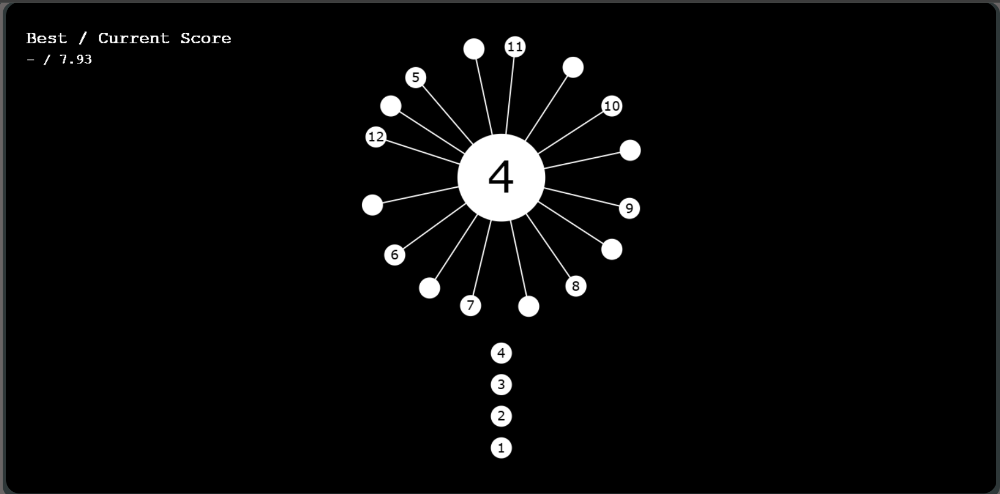

<h1 align="center">🎮 CoreBall Game</h1> 

Core Ball is an addicting online arcade game that will test your timing, patience, and precision. Inspired by the classic console game from the 2015s, Core Ball brings a simple yet incredibly challenging gameplay experience right to your browser. Your main goal is to throw small balls into a rotating core without letting them collide with any other balls already attached. It sounds easy at first — but as the levels progress, the rotation speed, direction, and patterns become trickier, demanding sharp focus and perfect timing.  
The game’s design is minimal yet captivating, making it easy to play but hard to master. Each throw requires strategy, rhythm, and accuracy to progress further. The best part? Core Ball features an impressive total of 216 levels, each uniquely designed to push your skills to the limit. As you move through the stages, you’ll face faster spins, tighter gaps, and unexpected twists that keep the excitement alive.   

### 🚀 Features  

🎯 Smooth and responsive gameplay  
🎵 Built-in background music and sound effects  
🏆 Real-time high-score tracking  
⚙️ Simple one-click controls  
💥 Increasing difficulty with each level  
🌈 Clean and minimal UI  
📱 Fully responsive on all devices  
🎯 216 challenging levels to test your timing and precision.  

### 🧠 How to Play  
Click or tap to launch a ball toward the rotating core.  
Avoid colliding with any previously attached balls.  
Attach all balls to the core to complete the level.  
The core spins faster at higher levels — stay alert!  

### 🛠️ Tech Stack  
| Technology | Purpose |  
|-------------|----------|  
| **HTML5** | Structure and layout |  
| **CSS3** | Styling and animations |  
| **JavaScript (Vanilla JS)** | Core game logic and interaction |  
| **Canvas API** | Rendering visuals and rotation effects |  

### 📸 Preview / Screenshot  

  

  

### 🌐 Live Demo  
👉 [Click here to play](https://monkey-type-org.github.io/monkeytype-test/)  

### 📂 Repository  
👉 [Click Git repo](https://monkey-type-org.github.io/monkeytype-test/)  

### 💡 Future Enhancements  

👥 Compete with friends to see who can reach the highest level  
🎨 Custom themes and color schemes  
🧱 New obstacles or bonus power-ups  
🪄 Dynamic visual effects  

### 🙌 Contributing  

**Contributions are welcome!**  
If you’d like to improve the gameplay, UI, or add new features, feel free to open an issue or submit a pull request.  

### ❤️ Support  

If you enjoyed the game, please ⭐ star this repository and share it with your friends!  